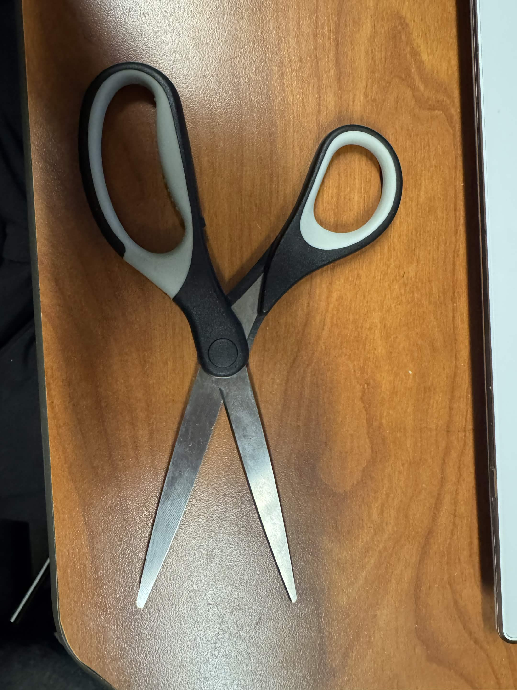
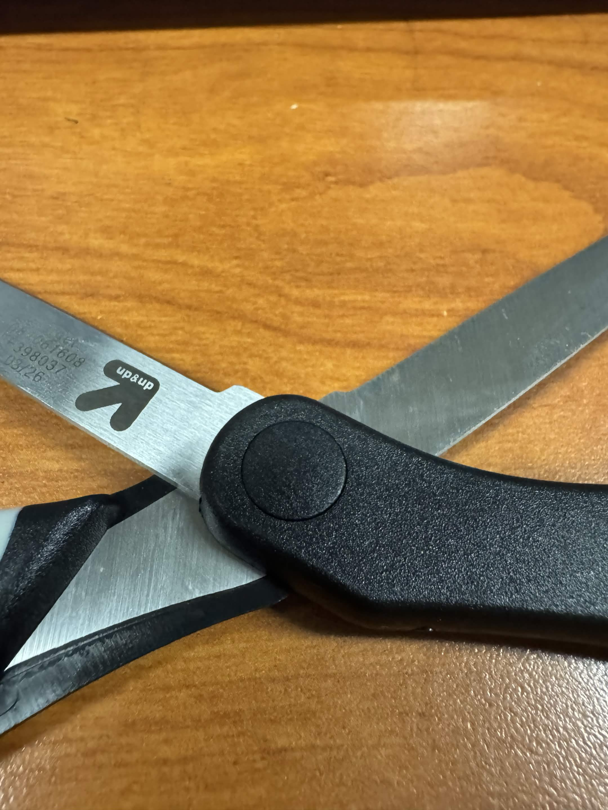

# A1 – Build Your Professional Portfolio

## Analyze 
**Task A: Portfolio Analysis**

Portfolio 1: https://thanhvtran.com/

This portfolio had it so it was quick to locate any specific assignment and piece of work completed. There is a sufficient amount of documentation regarding the individual that anyone could easily reproduce the work without asking a question. The portfolio website, however, does not provide the decision making process but instead just the end result of the work. The language in this portfolio does meet the standard of a document that I would hand over to employers.

Portfolio 2: https://soumyajit.vercel.app/

This portfolio was designed where a reader could easily locate any specific assignment of piece of work completed in a short amount of time. The information provided in the portfolio was sufficient that a colleague could reproduce the work without asking any questions. This website has the GitHub links and history where you can see how decisions were made. The language on this portfolio meets the standard of a document I would send over to employers.

**Task B: Product Analysis** - Scissors

A. The mechanical function of scissors is to convert an applied hand force into a concentrated shearing force between the two blades which produces relative sliding motion that cuts material.

B. The product is governed by the torque (moment) equation about the pivot. τ = F*d is the primary model and F(hand) * d(hand) = F(blade) * d(blade) is the blade force that can be related by the torque equation. An assumption to be made that makes the model valid is that the friction force at the pivot is negligible and treated as a right lever pivot.

C.

Left Blade/Handle and Right Blade/Handle

Connecting Screw

D. 
Patent ID: US6493947B2 Scissors | Inventor: Andrew John Stokes | Link: https://patents.google.com/patent/US6493947B2/en

i. Alternatives: Guillotine Paper Cutter or Utility Knife

ii. The original inventor designed the handles to be long compared with the distance from the pivot to the cutting edge. This provides the mechanical advantage of the scissors allowing a smaller hand force to be applied to produce a larger cutting blade force.

## Decide
**Homepage Identity** - The purpose of the homepage is designed to allow website visitors to understand of what this engineering portfolio contains and give an understanding of the contents and applications of the portfolio. The homepage is organized into the standards and expectations within the portfolio. This allows website visitors to find engineering projects, coursework, design work, problem-solving skills and design skills. Providing website visitors to quickly determine what the portfolio offers and navigates to the information most relevant to them.

**Intentional Customization** - The one intentional change made to this website was the header color from green to blue to contrast with the rest of the website. This change was made to help make the site more innovative and professional as companies like Indeed, LinkedIn, Ford, GM, Samsung and NASA all include a similar blue into their companies. This portfolio is a product and the color reflects an identity that reflects the product.

**Documentation Standard** - The quality that I will exhibit of my projects this semester will be professional, concise and in an efficient manner. All projects will be presented clearly and with a purposeful direction.

## Communicate
See "About Me" tab.
