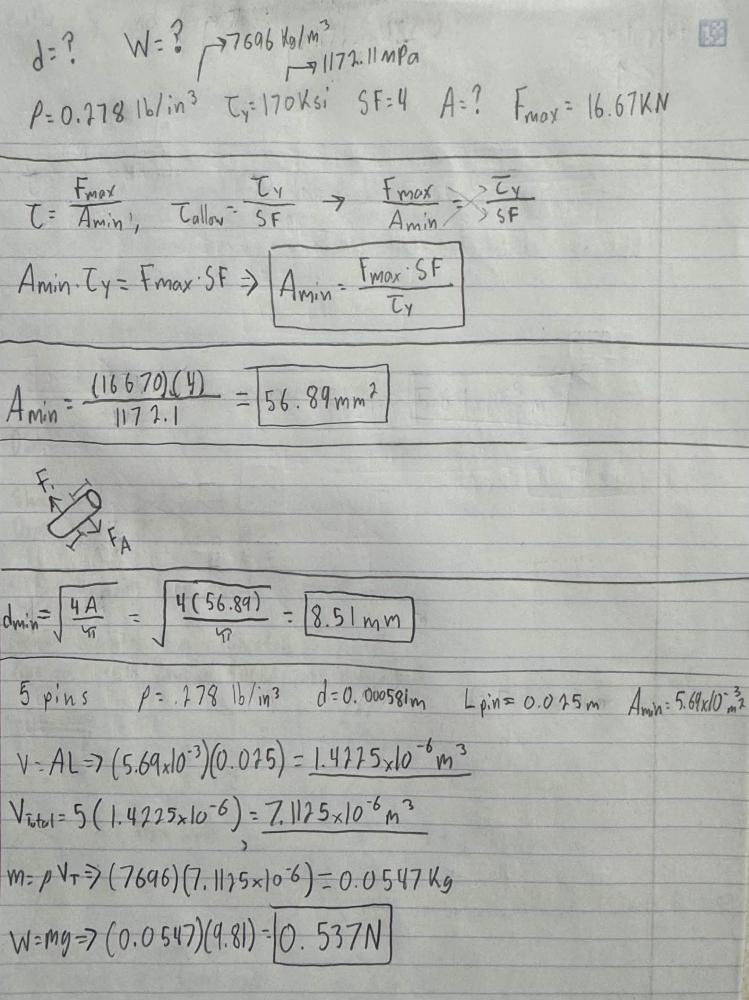
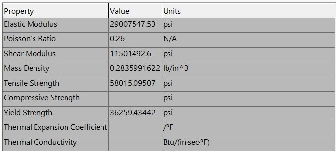
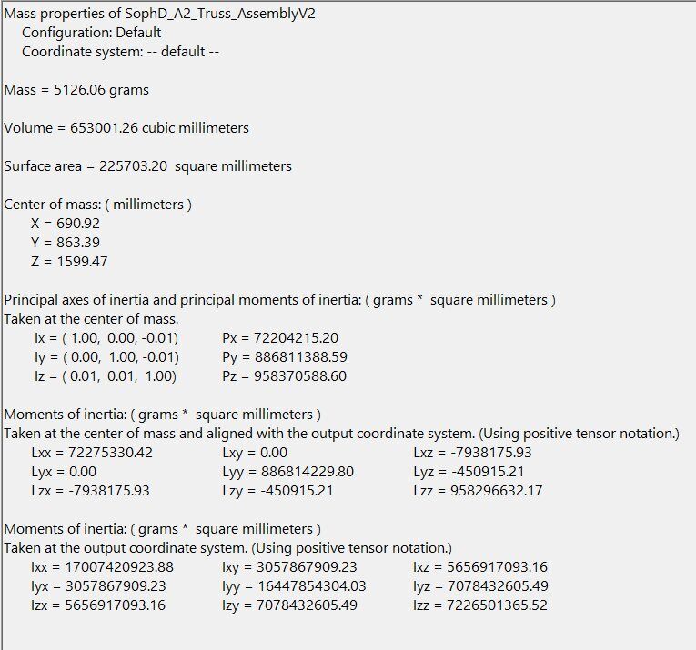

# A2 – Truss Stress Analysis

## Objective
For assignment #2, I was assigned to design a truss model to support the given loads based on the constraints below.

After much consideration and sketching many different designs, I finally landed on the design in the image below. The cross-sectional area was to be set identical for each element. The trusses need to be designed to be made out of A500 structural steel. The pins as well needed to have identical cross-sectional geometry.

## Analyze
After completing my design, the next task was to find all the external forces in order to solve all the internal forces of the truss geometry. The calculations below demonstrate the process of solving all the forces with A being a pin and B being a roller force in the image below.

After calculating my external forces, it was time to solve the internal forces using "Method of Joints" for each joint of the truss. I started at joint B and worked through each joint. Calculations and solutions for the internal equations can be found in the images below.

Now that all the external and internal forces were solved, next it was time to calculate the cross-sectional area of the elements using a safety factor of 3.5 and yield strength. As well as approximating the weight of the truss using the largest internal force. In the images below, all the unknowns are listed as well as the calculations for cross-sectional area and weight of the truss.

Now that all the truss is calculated, it was time to solve the minimum cross-sectional area and approximate the combined weight of the pins. The pins are made of a hardened tool steel with a yield shear strength of 170 ksi and a density of 0.278 lb/in^3. We can also assume the pins are in compression and won't fail in buckling. Also, a safety factor of 4 was needed. Calculations and solutions for the pins can be found in the images below as well as a free body diagram.

 area and wieght

With all the design and math complete for my truss, I was able to start designing in CAD. Since A500 structural steel is not in Solidworks, I decided to chose ASTM A36 Steel as my substitute. Listed below are the properties of the material.

 material properties

I decided to use Solidworks 2025 as it is the software I am most confident in compared to Creo or Fusion. In the image below, it is of the 0.5m member.

In the image below is the pinhole in all the truss members. The diameter of all the holes is 8.51mm.

After designing the 0.5m member, I made 0.8m and 1.6m members in CAD in the same design manor where the 0.8m was shortened to 0.788m and 1.556m for the 1.6m member. But all the pinholes are the proper diameter. After the trusses were all created, I designed my pin to the appropriate diameter. After this was done, I started to create my assembly after inserting the first pin into the truss as seen in the image below.

I created two pins, a 0.25m and 0.35m pin, to account for two and three members coming together at the same point as I made my thickness for the trusses to be 0.1m. While I was creating the assembly, I noticed an issue. There was a gap I couldn't fill in due to the placement of all the trusses, so, in order to correct this, I made a 1.6m truss at the top, so there would be one single plane instead of two at the top, which fixed the issue.

This is the final look of my truss assembly with different steel materials added to the trusses and pins (hence the color change).

With the CAD complete and the steel materials added and ensuring it met the safety factor, weight optimized goal and the geometric constraints. I used the Solidworks "Mass Properties" feature in order to determine the predicted weight accordingly.

## Decide
The geometry I selected was three triangles all stacked together. This decision was made because a triangle is the strongest geometric shape. This geometry also ensured that all the lengths and angles would be equal as the three triangles are the same size.

## Communicate
I learned a lot throughout this project. Learning how to actually assemble components I designed together was my biggest lesson. Being able to see what I design on paper isn't what always comes how I intended and how to approach the problem and solve it was a big learning curve. Another lesson I learned was time management. This assignment took me 10–12 hours to complete, so I made the excellent decision to start early. Had I not, I would've been behind and potentially not have the assignment completed.

## Likelihood of Failure Modes in Truss Components
**Part 1:**
1. The expected failure mode for each truss is:
AD, BE, DE are in tension, therefore, tensile yielding.
AE, BC, CE are in compression, therefore, buckling.
CD is a zero-force member, therefore, no structural failure under primary design loads.

2. A500 Structural Steel is a brittle material.

3.
   For the tension members (AD, BE, DE), they're primarily against yielding stress. The calculated tensile stresses are below the allowable stress, so the members are sized safely. 

  For the compression members (AE, BC, CE), can fail in buckling before reaching the yield strength. But, since they're assumed to not fail under buckling they're against compressive stress. The calculated compressive stresses are below the allowable stress, so the members are sized safely. 

5. A design modification I would do is to increase the cross-sectional area. This would which reduces compressive stress.

**Part 2:**
1. The expected failure mode for the pins is shear across the pin cross-sectional area

2. Known credible sources: https://www.sciencedirect.com/topics/engineering/von-mises-criteria
   
Von Mises Criteria establishes yield strength of ductile structural steel at 60% of the tensile yield strength. Shear stress is lower than tensile yield strength, causing pins under load to fail mostly in shear.

3. A design modification I would do is to increase the pin diameter. This would increase the cross-sectional area which reduces the shear stress to below maximum shear strength.

## CAD Files

[SopH_D_25mm_Pin.SLDPRT](SopH_D_25mm_Pin.SLDPRT)

[SopH_D_35mm_Pin.SLDPRT](SopH_D_35mm_Pin.SLDPRT)

[SopH_D_500mm_Truss.SLDPRT](SopH_D_500mm_Truss.SLDPRT)

[SopH_D_800mm_Truss.SLDPRT](SopH_D_800mm_Truss.SLDPRT)

[SopH_D_1600mm_Truss.SLDPRT](SopH_D_1600mm_Truss.SLDPRT)

[SopH_D_A2_Truss_AssemblyV2.SLDASM](SopH_D_A2_Truss_AssemblyV2.SLDASM)
