# A2 – Truss Stress Analysis

## Objective
For assignment #2, I was assigned to design a truss model to support the given loads based on the constraints below.

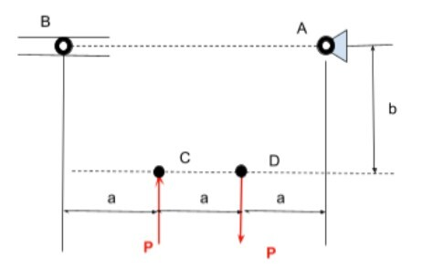

After much consideration and sketching many different designs, I finally landed on the design in the image below. The cross sectional area was to set identical for each element. The trusses need to be designed to be made out of A500 structural steel. The pins as well needed to have identical cross-sectional geometry.

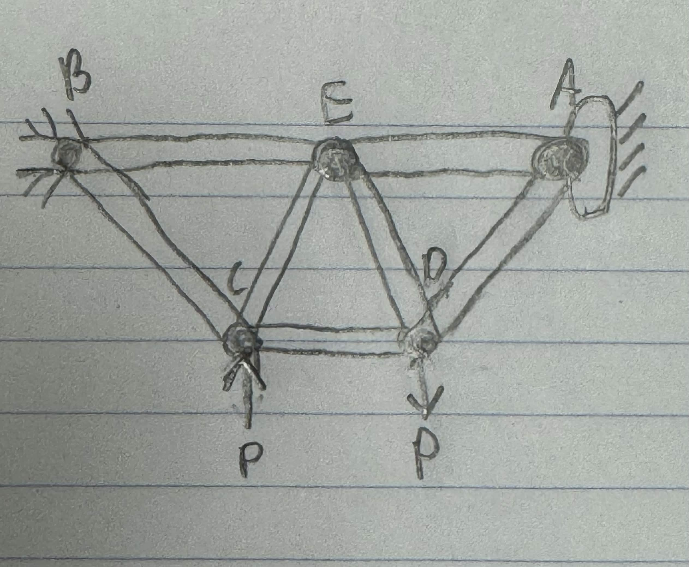

## Analyze
Following completing my design, the next task was to find all the external forces in order to solve all of my internal forces of the truss geometry. The calculations below demonstrate the process of solving all the forces with A being a pin and B being a roller force in the image below.

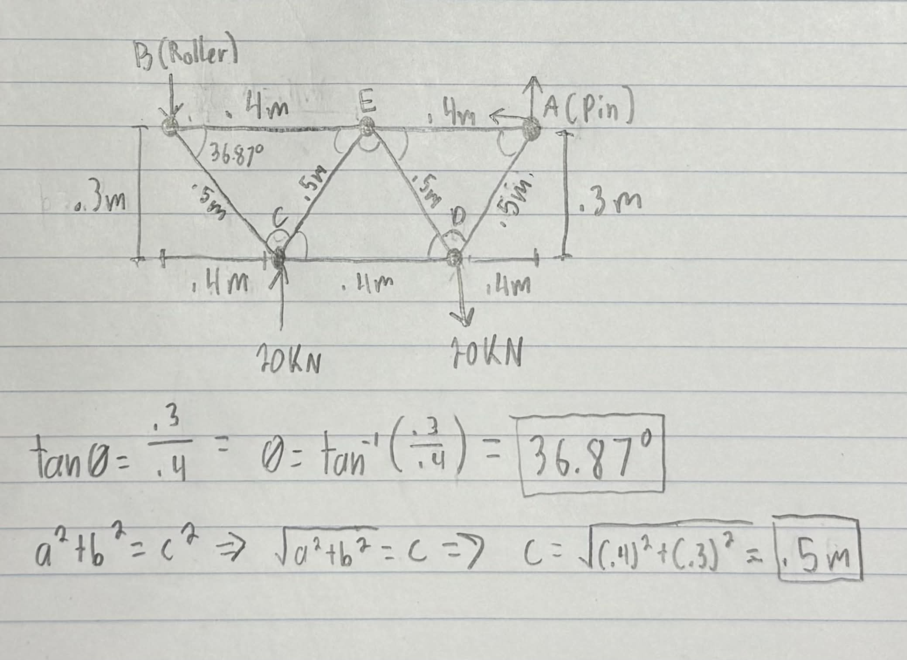
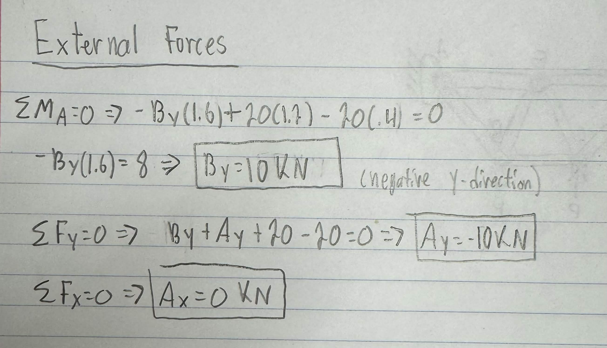

After calculating my external forces, it was time to solve the internal forces using "Method of Joints" for each joint of the truss. I started at joint B and worked through each joint. Calculations and solutions for the internal equations can be found in the images below.

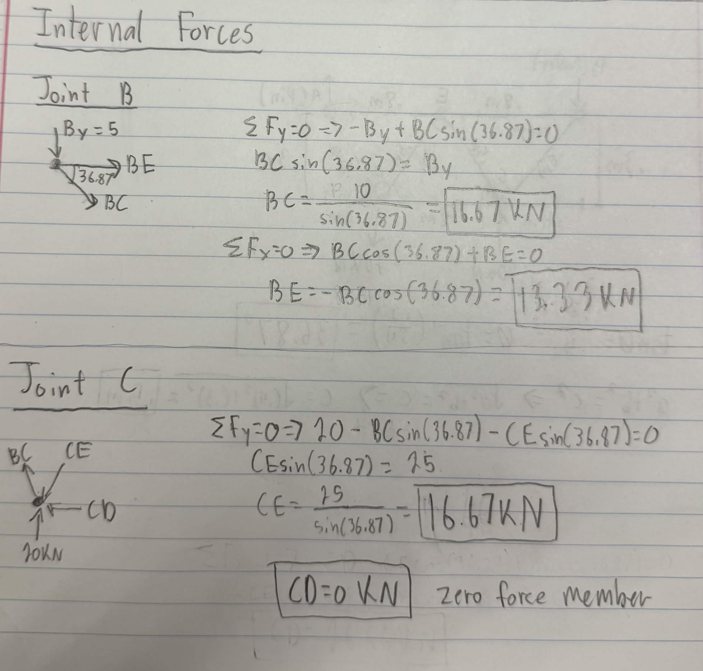
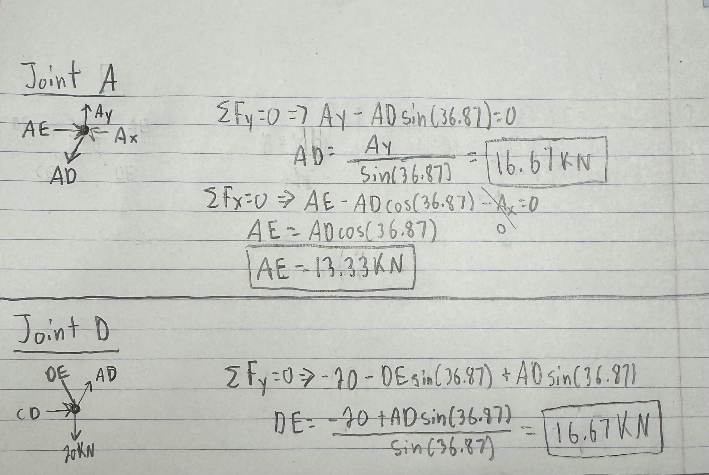
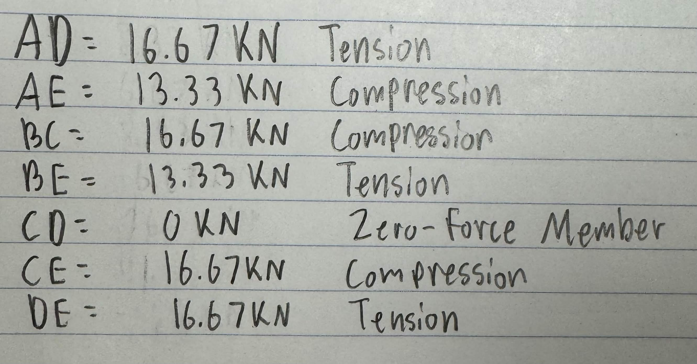

Now that all the external and internal forces were solved, next it was time to calculate the cross-sectional area of the elements using a safety factor of 3.5 and yield strength. As well as approximating the weight of the truss using the largest internal force. In the images below, all the unknowns are listed as well as the calculations for cross-sectional area and weight of the truss.

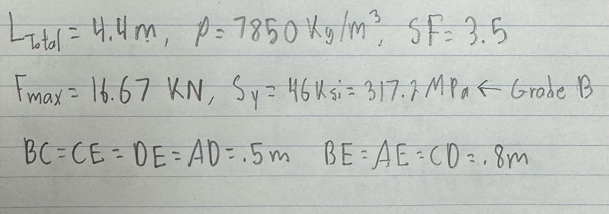
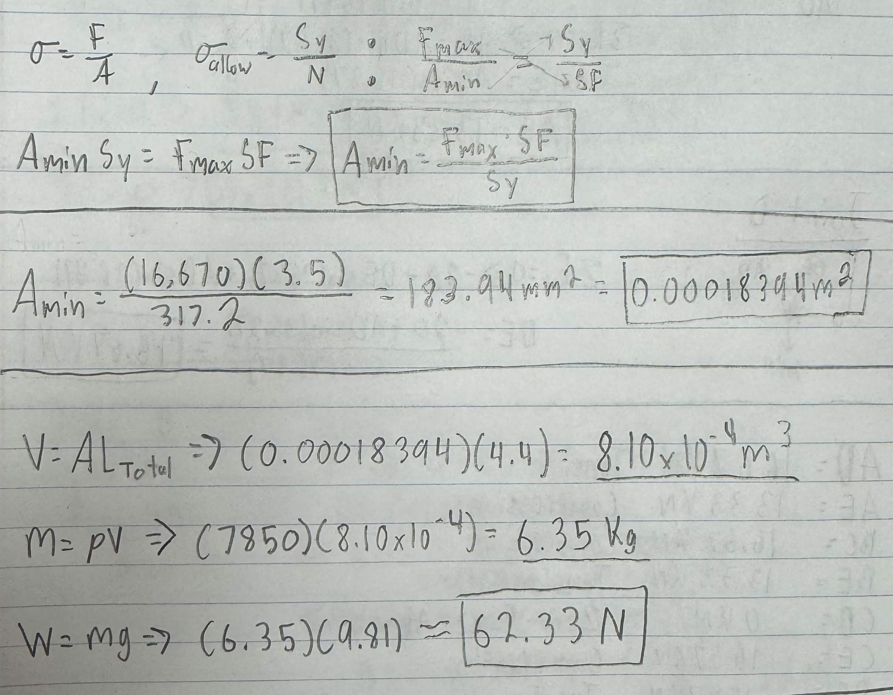

Now that all the truss was calculated, it was time to solve the solve the minimum cross-sectional area and approximate the combined weight of the of the pins. The pins are made of a hardened tool steel with a yield shear strength of 170 ksi and a density of 0.278 lb/in^3. We can also assume the pins are in compression and won't fail in buckling. Also, a saftey factor of 4 was needed. Calculations and solutions for the pins can be found in the images below as well as a free body diagram.

 area and wieght
 fbd

With all of the design and math complete for my truss, I was able to start designing in CAD. I decided to use Solidworks 2025 as it is the software I am most confident in compared to Creo or Fusion. In the image below is of the 0.5m member. 

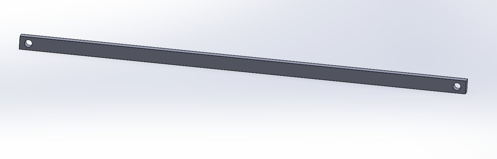

In the image below is the pin hole in all of the truss members. The diameter of all the holes is 8.51mm.

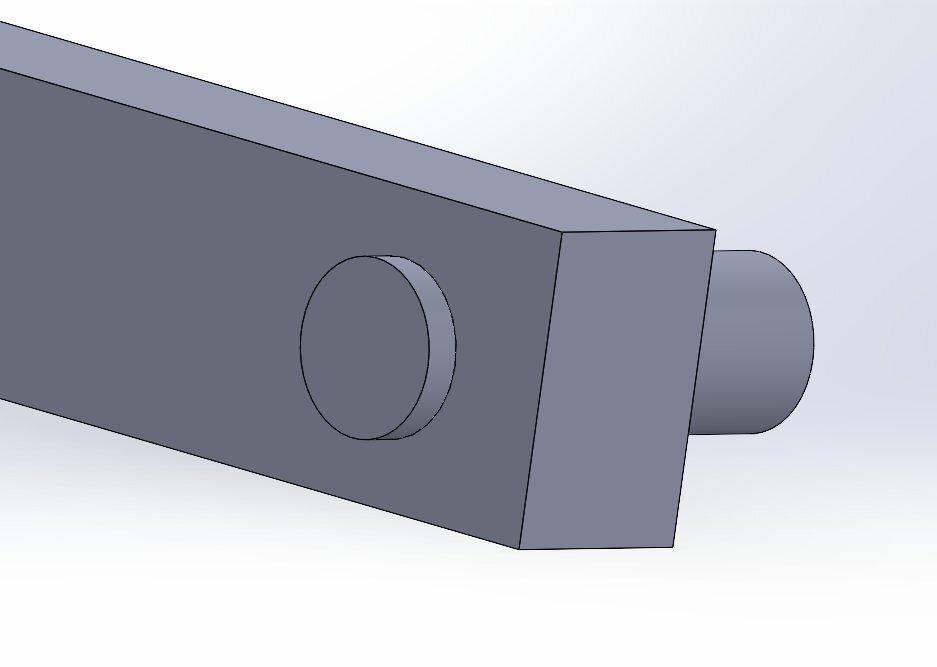

After designing the 0.5m member, I made a 0.8m and 1.6m members in CAD in the same design manor where the 0.8m was shorten to 0.788m and 1.556m for the 1.6m member. But all of the pin holes the proper length. After the trusses were all created, I designed my pin to the appropriate diameter. After this was done, I started to create my assembly after inserting the first pin into the truss as seen in the image below.

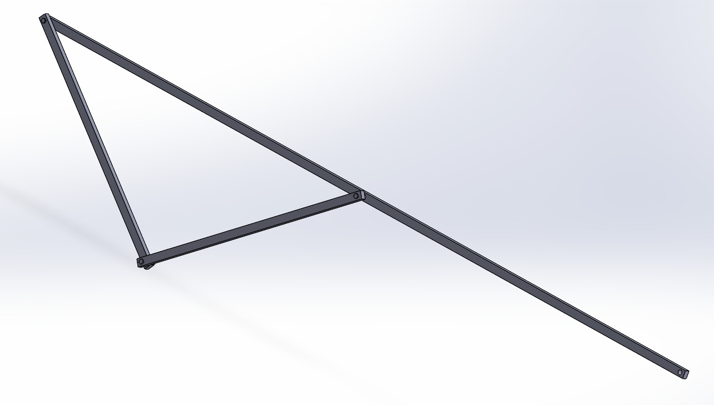

I created two pins, a 0.25m and 0.35m pin to account for two and three members coming together at the same point as I made my thickness for the trusses to be 0.1m. While I was creating the assembly I noticed an issue, there was a gap I couldn't fill in due to the placement of all the trusses, so, in order to correct this, I made a 1.6m truss at the top so it would be one single plane instead of two at the top which fixed the issue.

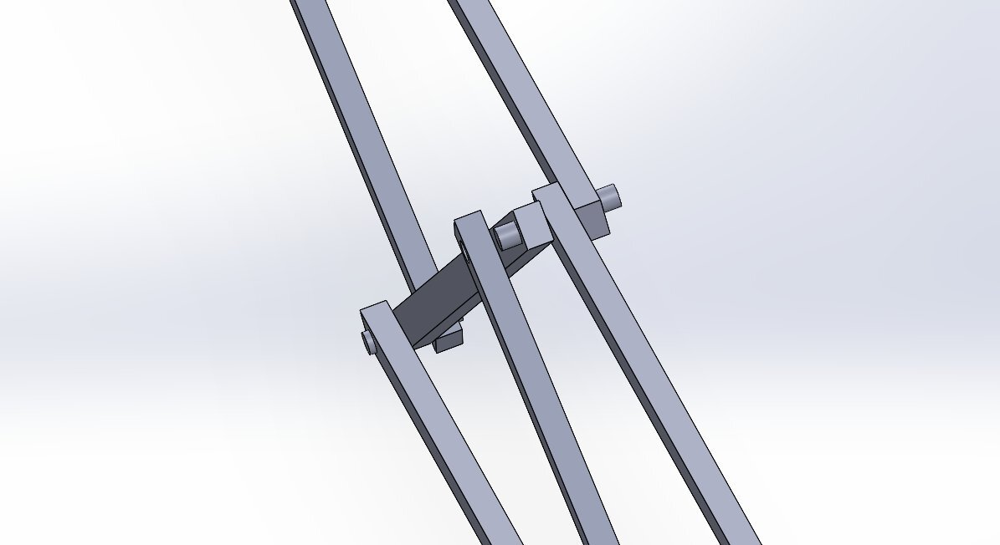
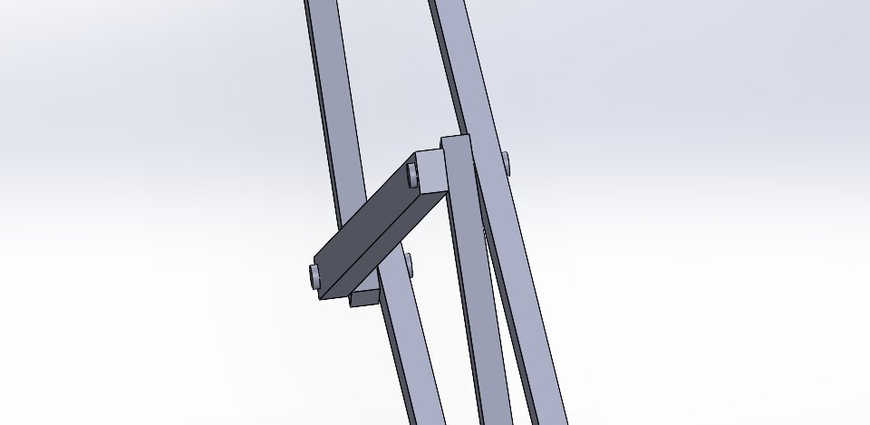

This is  the final look of my truss assembly with different steel materials added to the trusses and pins (hence the color change).

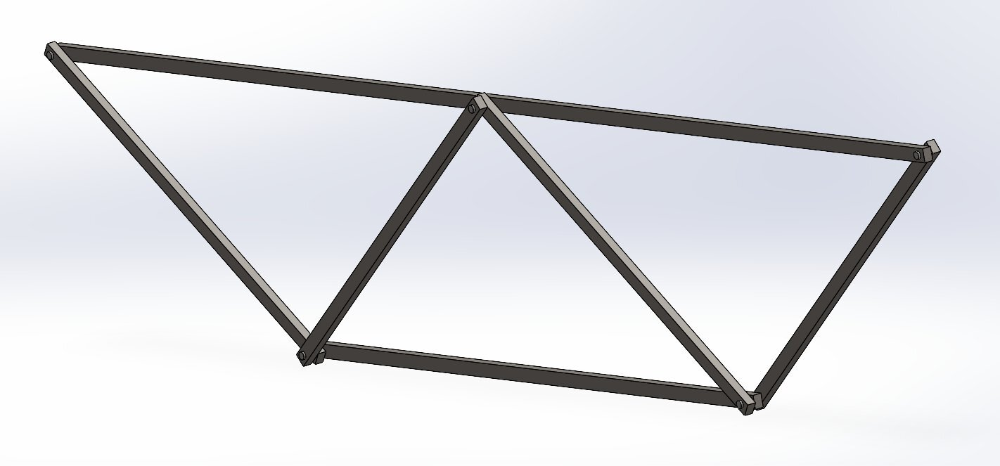

With the CAD complete and the steel materials added and ensuring it met the safety factor, weight optimized goal and the geometric constraints. Then, I determined the predicted weight accordingly utilizing the CAD.

## Decide
_Which geometry did you select, and why? This is your first open design choice in the course — defend it._
The geometry I selected was three triangles all stacked together. This decision was made because a triangle is the strongest geometric shape.
## Communicate

