# A3 – [Parametric and FEA]

## Objective
* Use axial deflection modeling to to design the dimensions
* Parametric design to determine a bars length
* Introduce us to FEA (Finite Element Analysis)
* Introduce us to nking dimensions to appropriate parameters in CAD
* Compare and contrast different analysis

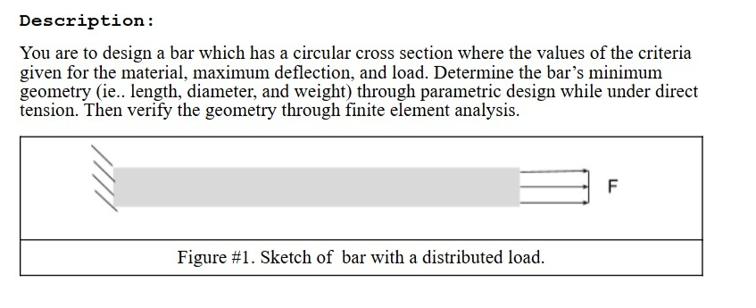

## Analyze
I started off this assignment by writing out the parameters given to me, and choosing parameters that were unknown. I chose my force to be 400lbf, the diameter to be 0.25in, and the Young's Modulus to be 9.2x10^6. After deciding all my parameters, I did my hand calculations in the image below.

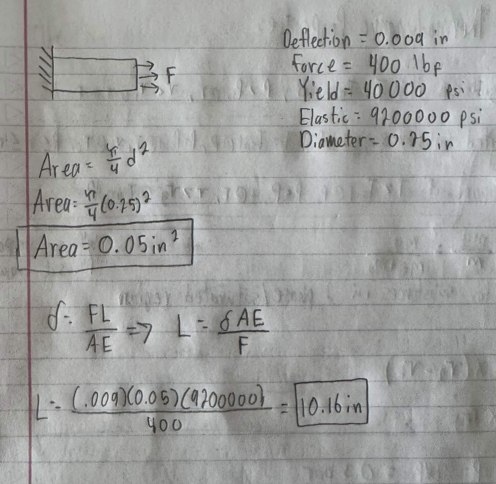

I then started a new CAD file in Solidoworks and set up all of my parametric equations based off hand calculations. In the image below, it displays all the parametric equations set.

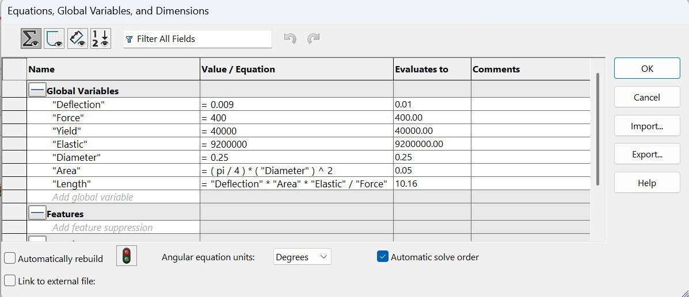

After all the dimensions were set up into SolidWorks, it was time to design my bar. I started off with my cross-sectional area using my diameter dimension. After, I used the extrude feature and used my length dimension to complete my bar.

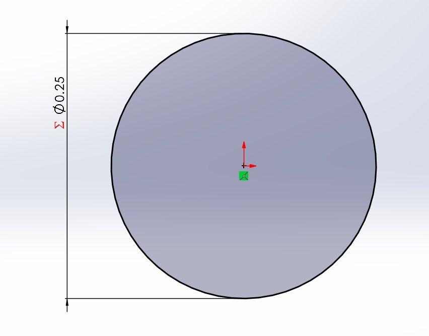
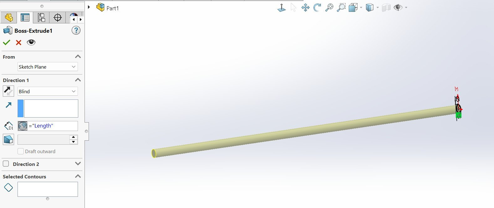

Now that the bar was complete, I added a material property to the bar before doing the FEA. I decided to choose 6061-T4 (SS) out of all the options, as the Yield Strength and Elastic Modulus were close to the values I decided. The material properties for 6061-T4 (SS) and the weight of the bar are shown below.

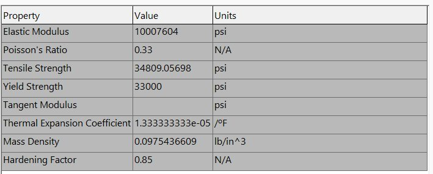
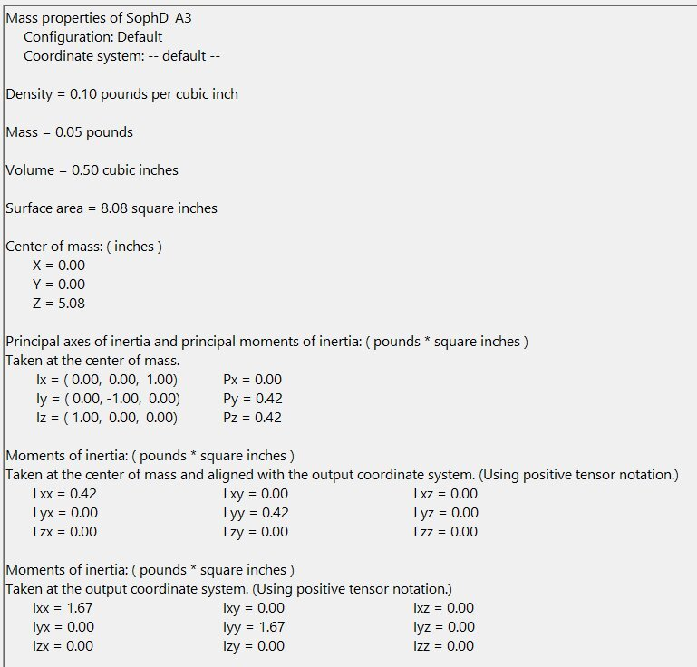

From here, I started my FEA design. First I added a fixed geometry fixture on one end of the cross-sectional area and then an external force with it set to 400lbf force on the other end of the cross-sectional area. I had my force direction in the opposite direction to my fixture. Following adding the features, I turned my bar into a mesh by using the mesh feature. Below are images displaying the added features.

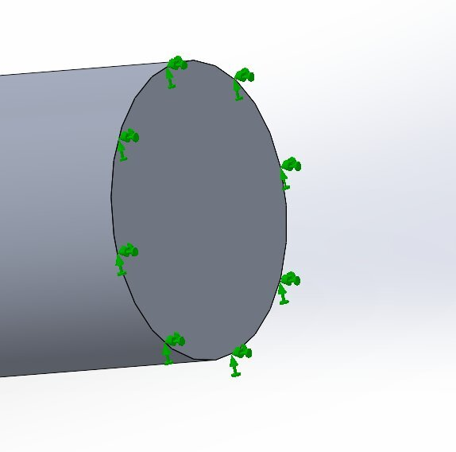
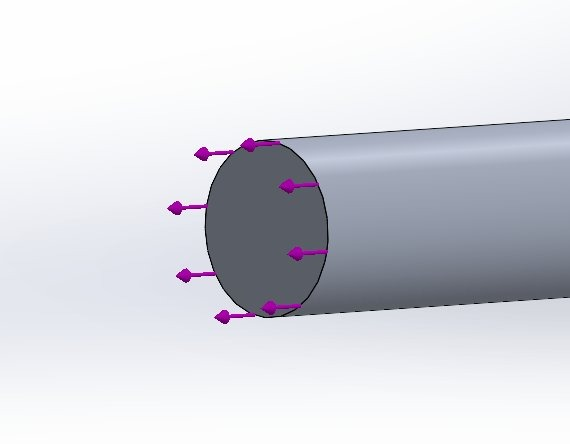

Now that everything was set up, it was time to run the FEA tests. I ran a test for stress (von Mises), displacement and strain. The results of the texts are shown below.

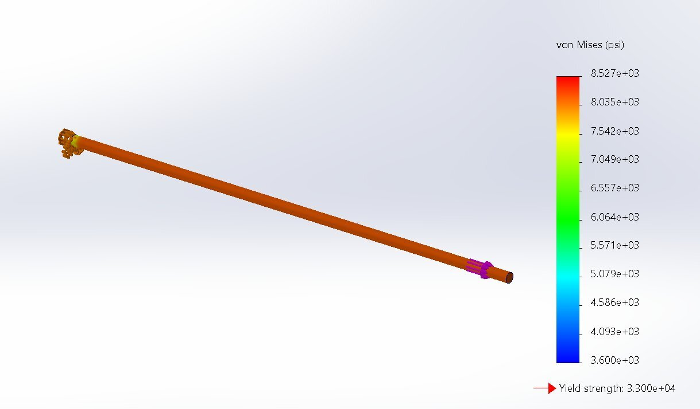 Stress
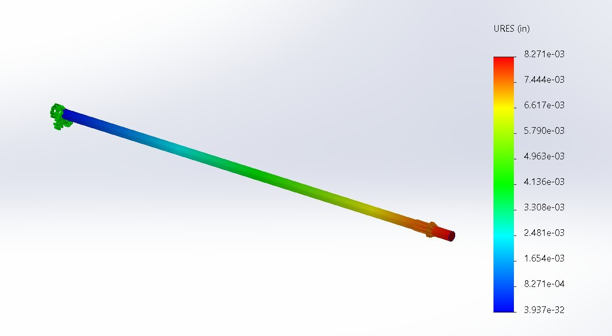 Displacement
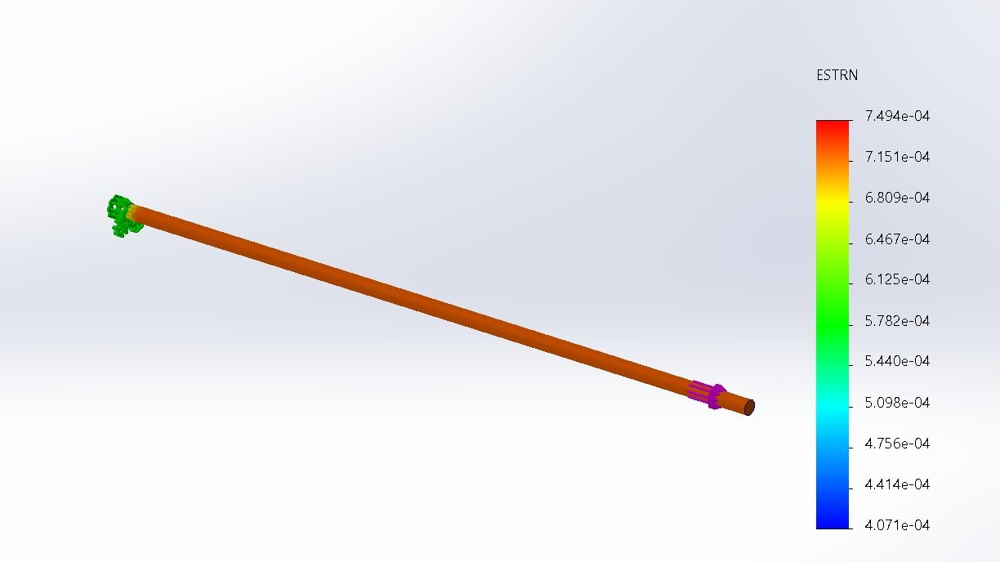 Strain

## Reflection
With all the tests complete, I checked that the maximum stress was lower than the strength of aluminum and calculated the safety factor below. I also calculated the difference in deflection based off the data gathered from my test. The calculations are shown in the image below.

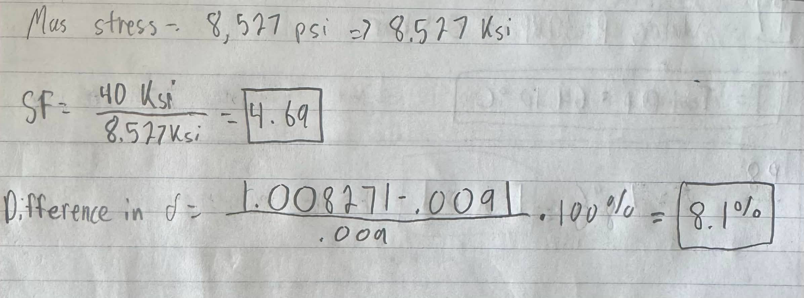

There is a meaningful discrepancy between the two deflections. I would say the root cause of the discrepancy is the material property difference. There is a meaningful difference between Young's modulus and the yield strength from the hand calculations and the actual from the 6061-T4 (SS). This big disparity, I believe, will cause this discrepancy. I would trust the FEA results more for this design, as it actually takes into account real properties and gives real data that was tested in the real world, which would be very similar.

Following this, I estimated my peak stress and my safety factor if I added a pin hole into the bar.

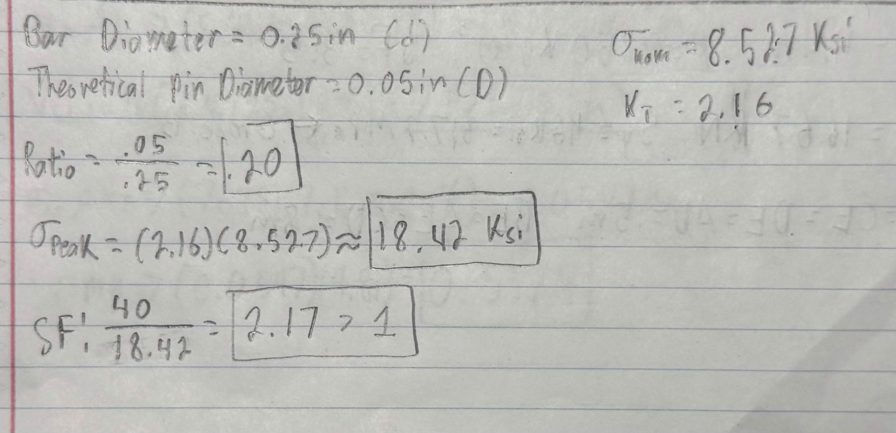

## Lessons Learned
I learned a lot from this project. I have never used FEA before and not on Solidworks, so, learning how to set up was a difficult learning curve as I was having trouble how to add my fixed geometry to the correct dimension. I was also having trouble with my units. I didn't realize at first I could convert the units in the FEA analysis in Solidworks automatically. This assignment took me around 4 hours.

## CAD File

[SophD_A3.SLDPRT](SophD_A3.SLDPRT)

## Modify Design Parameters
Now that I was tasked to modify my parameters, I decided to increase everything in hopes of getting a smaller percent error. My prediction was that my length would increase, since I increased all of my values. After making this guess, I calculated my new values.

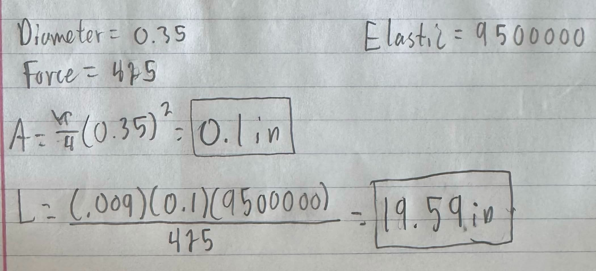

My prediction was correct based off of my calculations. My length increased and by a significant amount too.
