# A4 – [Motor Mount]

## Objective
For this assignment, I was tasked with designing a motor mount for a Brushed 24V DC Gear Motor 3.6Kg.cm/46RPM w/ 99.5:1 Planetary Gearbox. Below is an example of what an assembly looks like of the motor with the mount attached. 

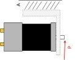

The force that is received on the shaft of the motor is 300 Newtons. We have a safety factor required of 3. The max deformation allowed is 0.30mm. In the figure below, you can see the given dimensions of the gearbox that the motor mount will attach too. These dimensions are crucial for designing features 1 and 2. 

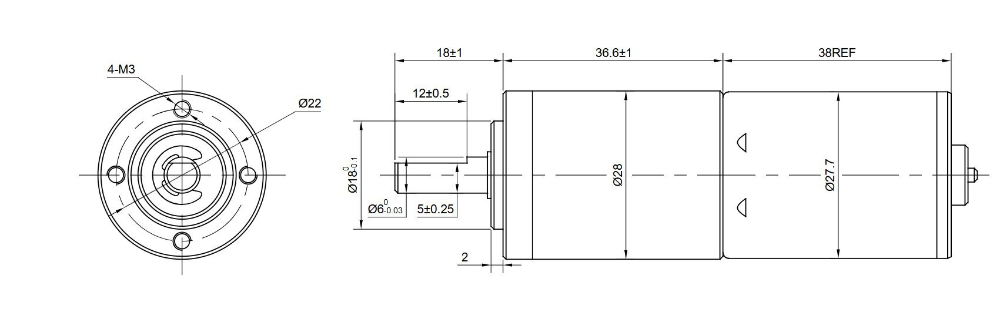

## Feature 1
To design this feature, I started off by listing out all of my known and unknown factors. For my material, I chose PLA for its good yield strength and modulus of elasticity.

For my design of feature #1, I decided to make my length 45mm and my base of the feature to be 35mm. This allows plenty of room for the gearbox to fit securely into the feature. After I decided these factors, I drew out my FBD. After that, I solved the needed height using the deformation and stress equations. I ended up choosing my stress height over my deformation height, as the deformation height stuck out too much in the CAD model and I couldn't fit the shaft of the gearbox. After this, I solved the cross-sectional area of feature #1. In the figure below, are all the knowns and unknowns listed, free body diagram, algebraically and numerically solved equations.

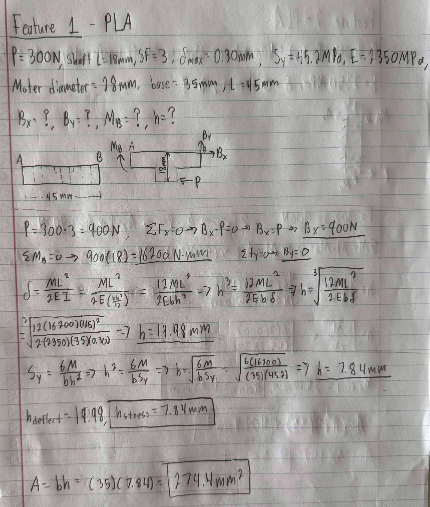

## Feature 2
For designing feature #2, I took a very similar approach as I did to feature #1. I chose my length to be 40mm and base to be 35mm. After this, I listed all of my knowns and unknowns, drew my free body diagram, used the same algebraic equations from feature #1 for feature #2 to solve numerically, and finally solved the cross-sectional area of feature #2. Similar to feature #1, I used my stress height over the deformation height, as the deformation height was a very large number. In the figure below, there are all the knowns and unknowns listed, the free body diagram, and the numerically solved equations.

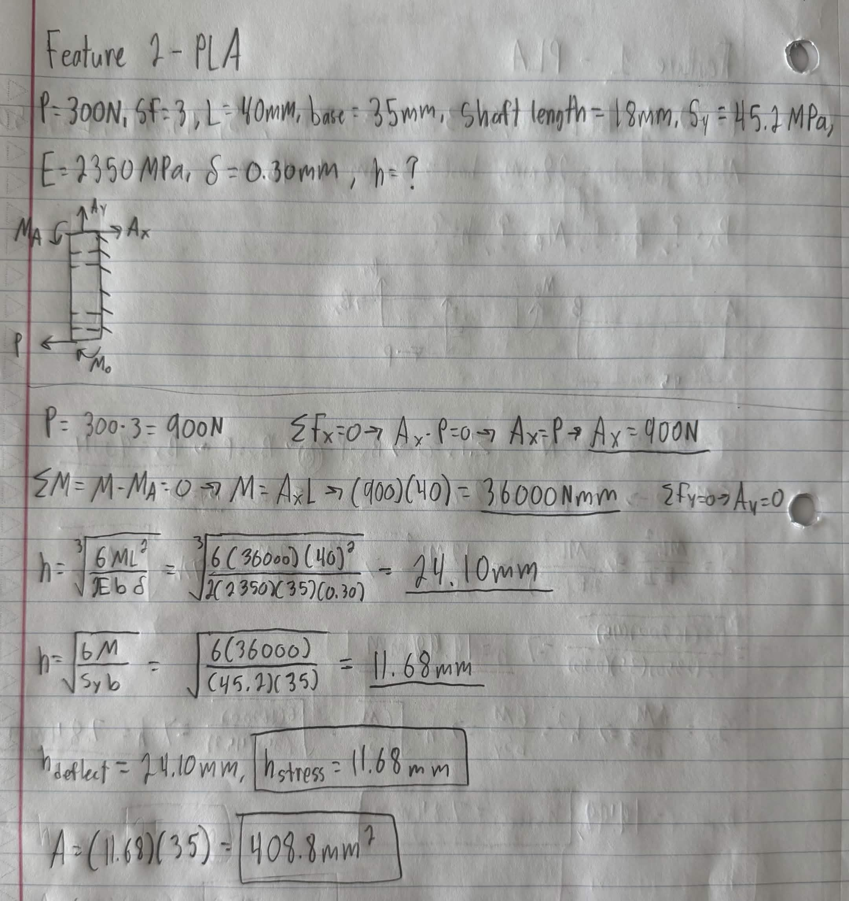

## Sketch
In the figure below, you can see a drawn out isometric view of the full assembly, combining feature #1 and feature #2. I also marked my important dimensions on the sketch as well.

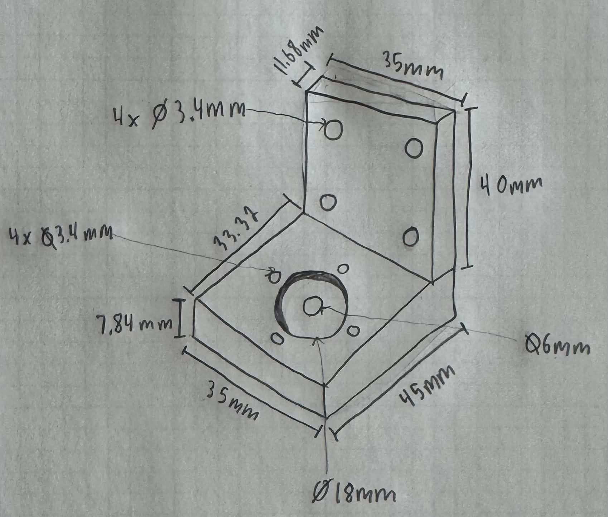

## CAD Model (Parametric)
I started off with my CAD model for feature #1. The first thing I did was set up my parametric equations as seen in the figure below.

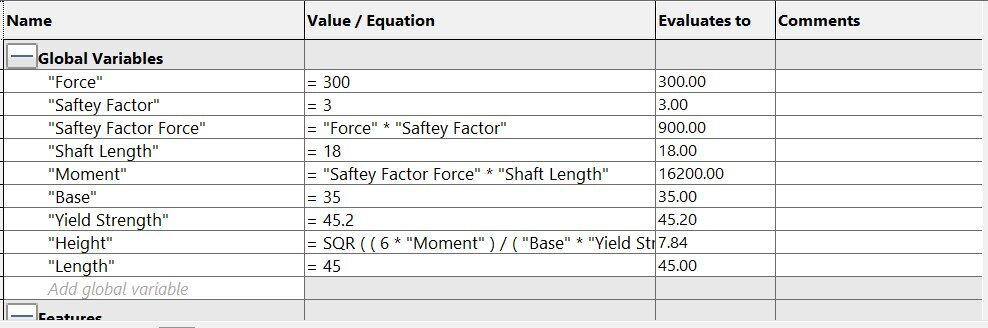

After having my parametric equations set up, I started off with the overall shape of feature #1 using values I previously solved. I then made the 18mm indent by making it 2mm deep based off the gearbox dimension. I then created my holes for the feature. I made a 6mm hole in the middle of the shaft, then using the 22mm diameter dimension from the gearbox, I was able to accurately place the 3.4mm boltholes around the indent. I was able to take advantage of Solidworks circular sketch pattern to streamline the process. In the figures below, displaying the process of modeling feature #1.

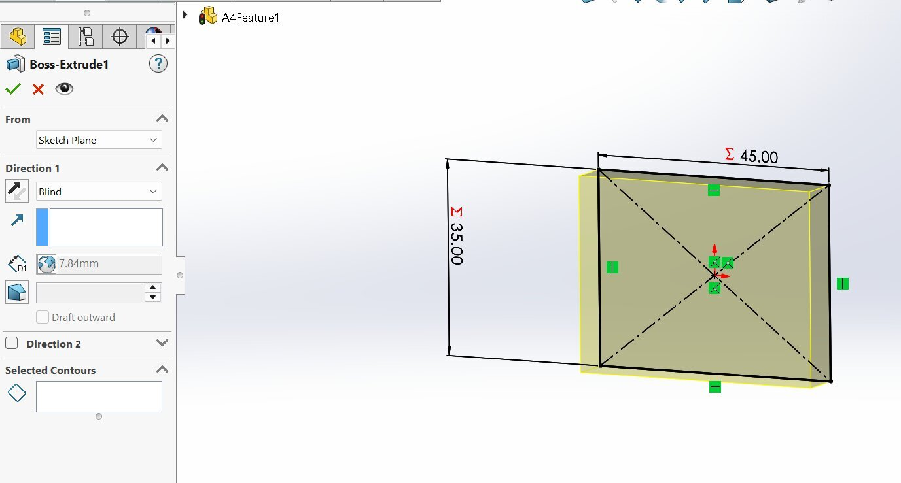
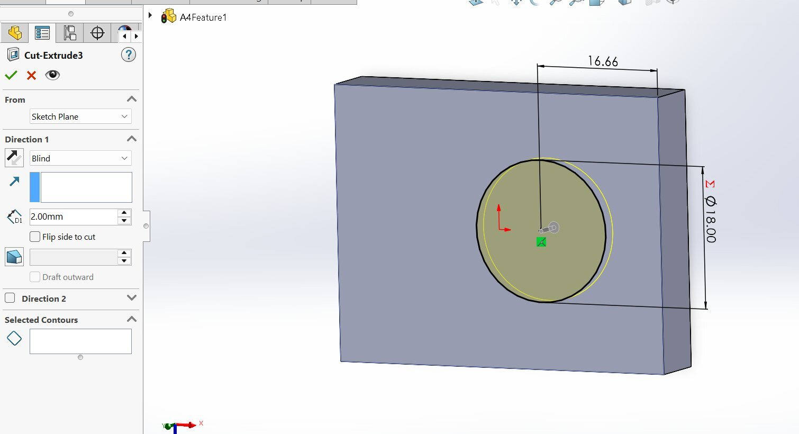
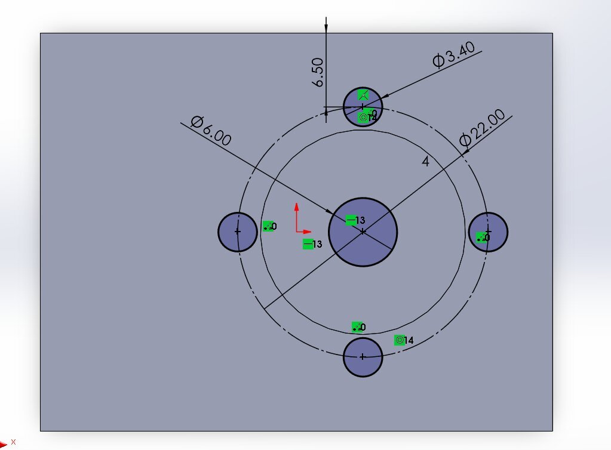
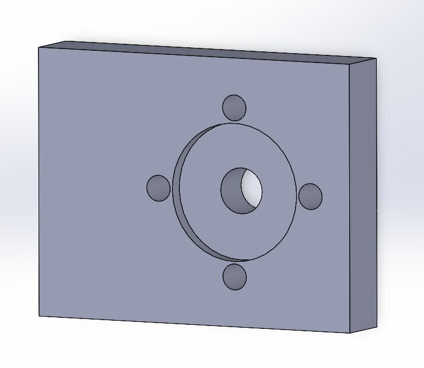

For feature #2, I started off very similar by establishing my parametric equations as seen in the figure below.

Afterward, I started off with the overall shape of feature #2 using values I previously solved. Then I made a 3.4mm bolthole and used centerlines around the overall shape to use the symmetric relation to easily have all four boltholes to be the same size and placed in the correct location.

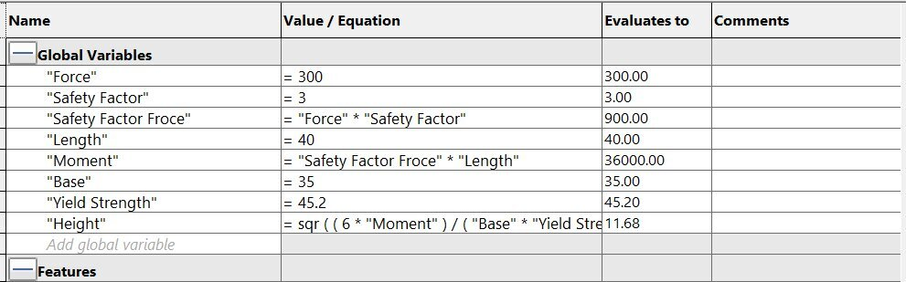
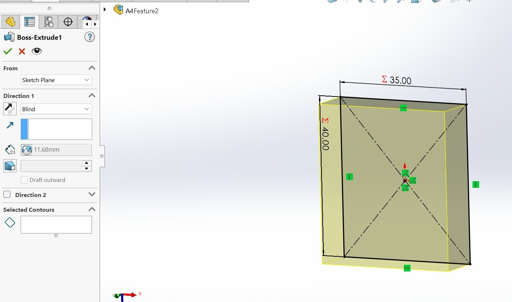
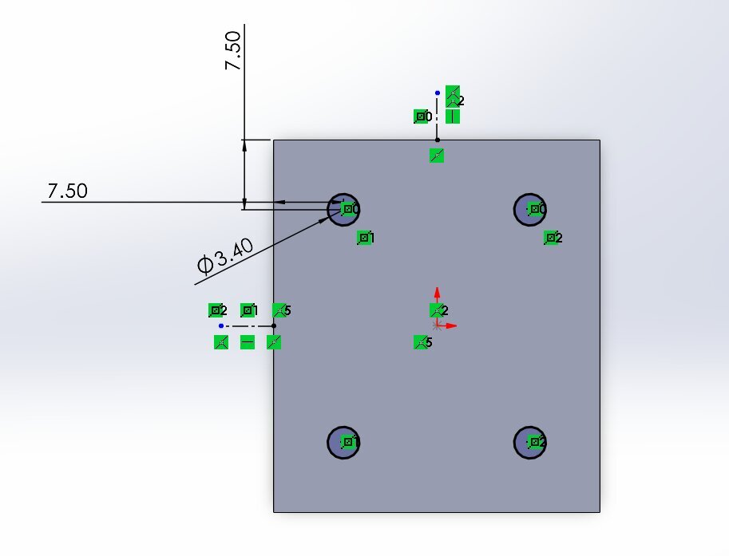

In the figure below is the completed assembly model. With both feature #1 and #2 placed and mated in the correct locations.

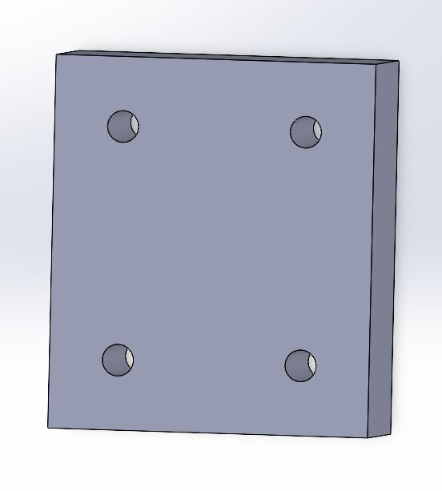

## Drawings - 2157
With the CAD model complete, I created a Multiview drawing using Solidworks. I included four views; Front View, Right Side View, Top View, and an Isometric View on the sheet. As well as applying ASME standard conventions.

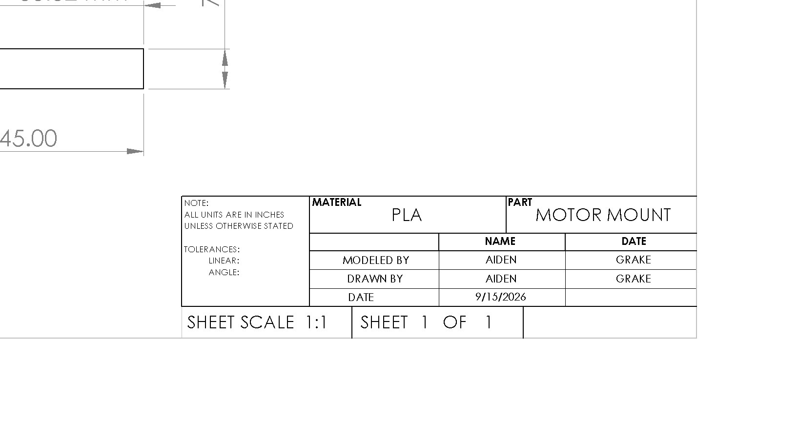

## Files

[A4Feature1.SLDPRT](A4Feature1.SLDPRT)

[A4Feature2.SLDPRT](A4Feature2.SLDPRT)

[A4Assembly.SLDPRT](A4Assembly.SLDPRT)
