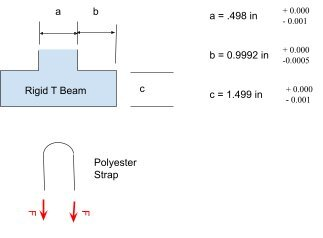
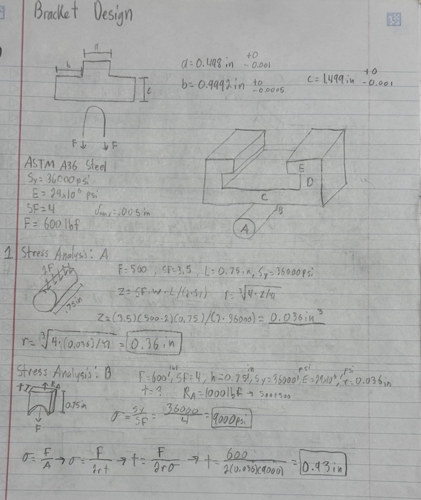
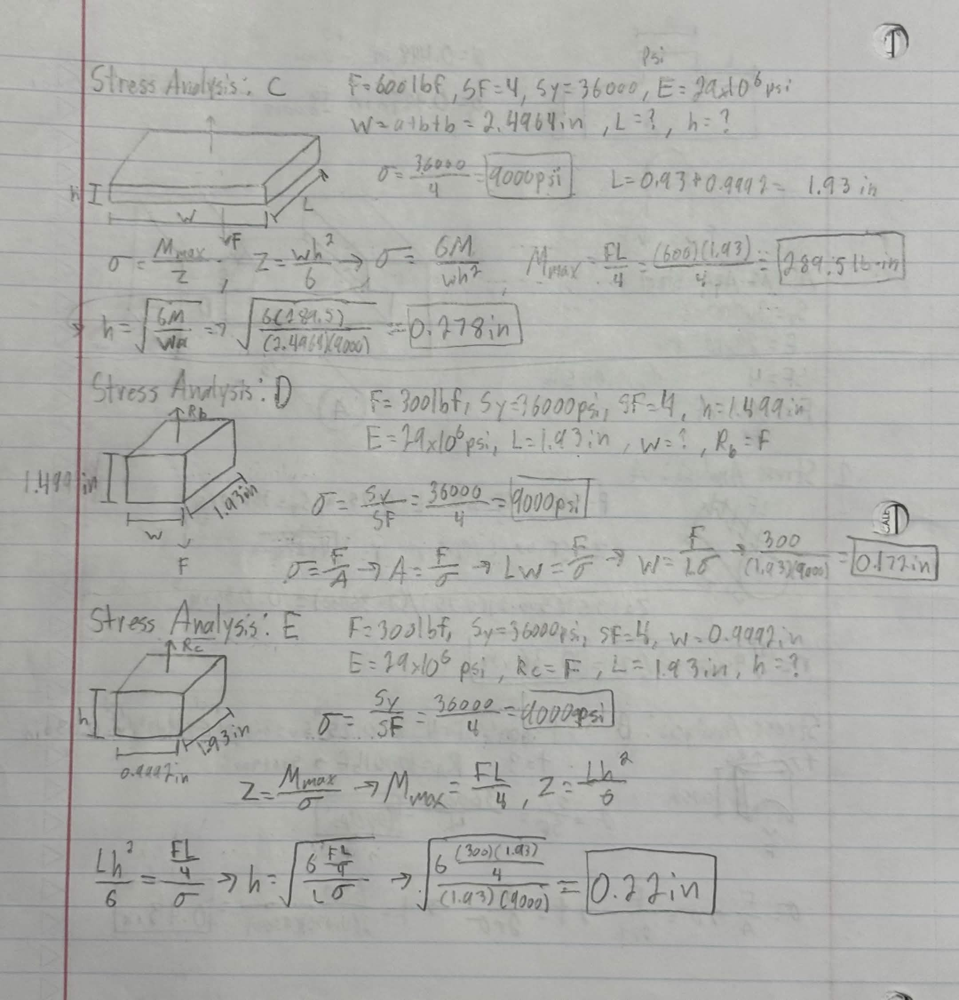
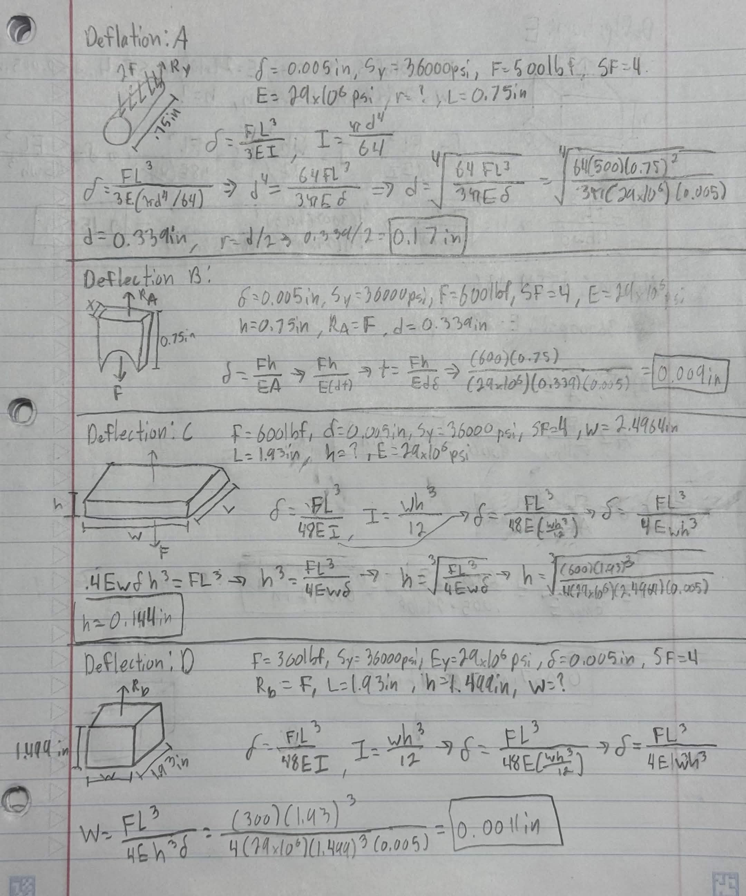
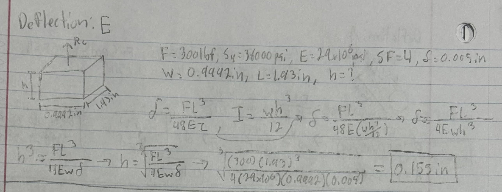
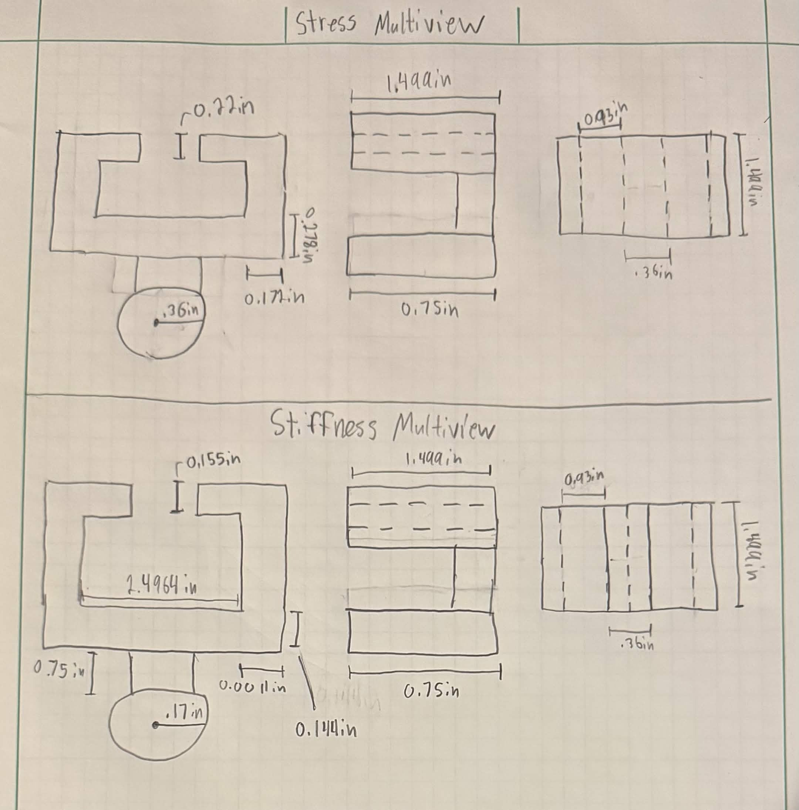
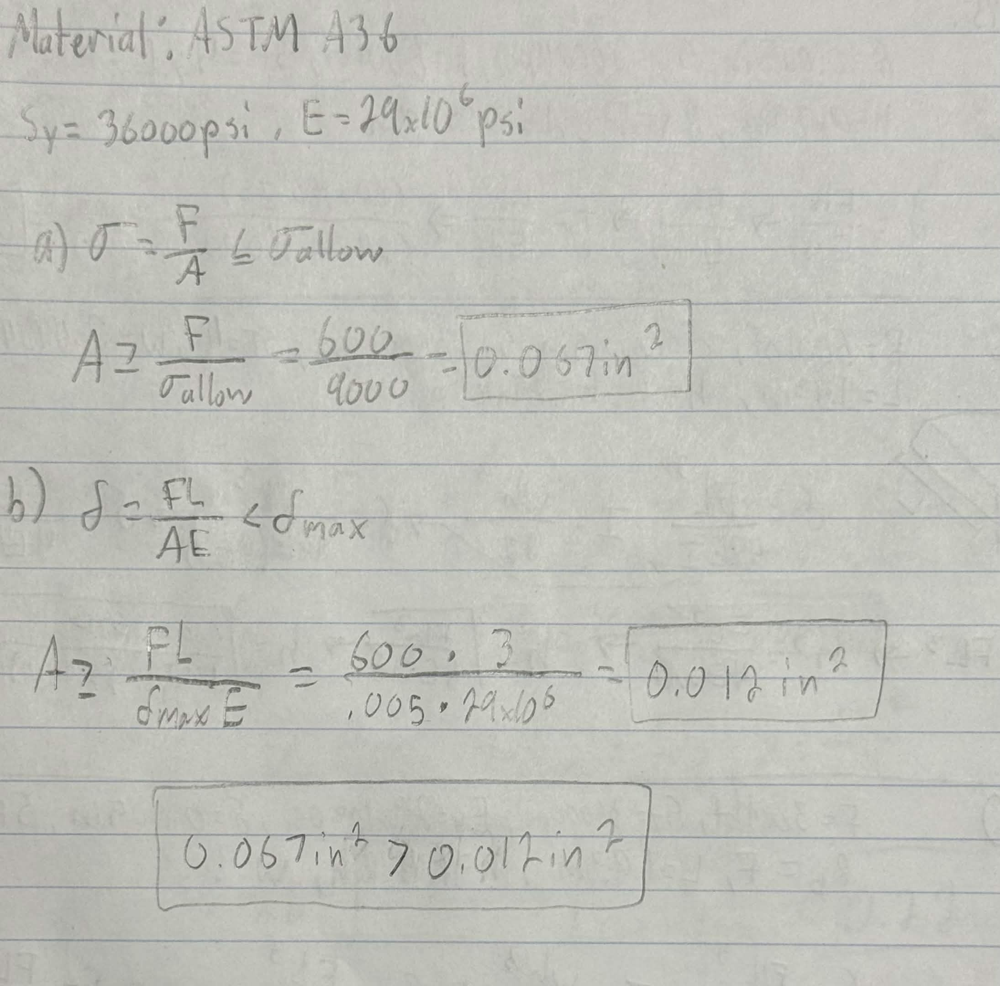
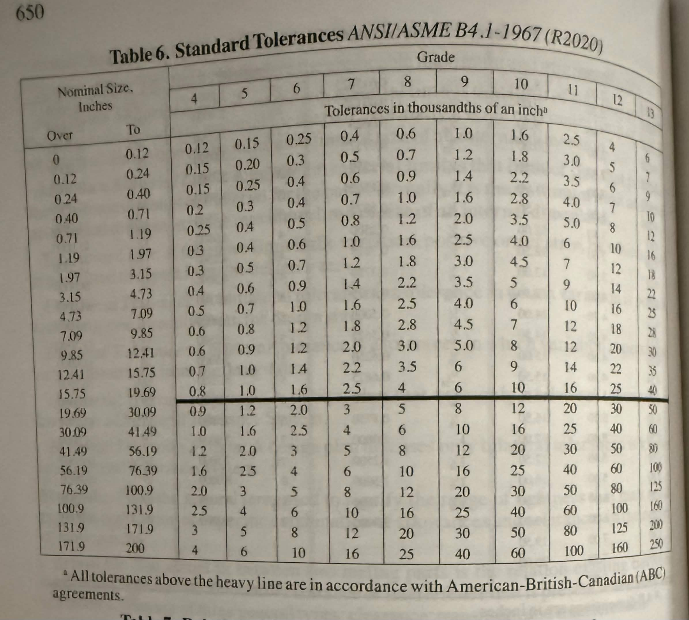
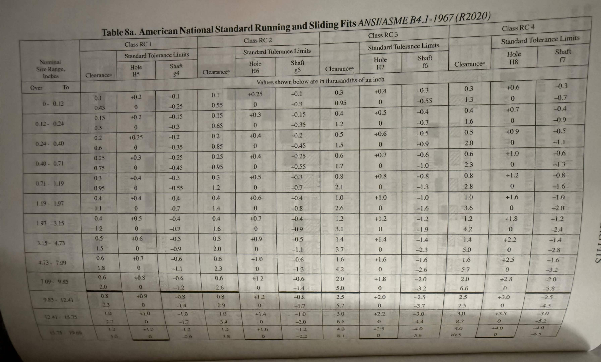

# A5 – [Bracket Design]

## Objective
* Conduct stress analysis to determine appropriate dimensions for structural features.
* Generate free body diagrams (FBDs) to visualize forces and constraints for each feature.
* Identify and document known and unknown variables, assumptions, and algebraic models for stress calculations.
* Perform stiffness analysis to establish minimum required dimensions based on deflection constraints.
* Compare stress and stiffness analyses to ensure structural integrity and compliance with given constraints.
* Create detailed multiview sketches illustrating dimensions derived from both stress and stiffness analyses.
* Reflect on and document key engineering lessons learned throughout the process.

## Analyze
For my bracket design, I started off with choosing my material. I chose ATSM A36 as my material because of its reliable strength and its affordability. ASTM A36 has a yield strength of 36,000 psi and a Young's Modulus of 29000000 psi. The force of the strap is between 500lbf to 800lbf, so I decided 600lbf for the load. The images below outline the assignment.

I started off with my stress design. After making my design, I sectioned my bracket into five parts. I then began by listing out all of my knowns and unknowns for each section. After listing all the knowns and unknowns, I drew my free body diagrams and then solved for the minimum dimensions for the stress acting on the components. In the images below, they display all of my work.

After finding all the dimensions for the allowable stress, I moved on to the next part of the assignment. For this part, I had to find the dimensions for the maximum deflection. I did the same process as I did for calculating my allowable stress dimensions. In the images below, they display all of my work.

## Decide
Now with all of my dimensions for both allowable stress and maximum deflection accounted for, I began the Multi-View Drawings for both allowable stress and maximum deflection. I drew front, right and top views for both.

## Lessons Learned

* Governing failure mode - Feature E: Stress required the height was 0.22in and for deflection, the height was 0.155in.
 
* Error propagation - A value that was carried over into another equation was my thickness value from B. If that value is off, then other dimensions would be off as well.

* Assumption sensitivity - One assumption I made was my material choice. If I changed my material the yield strength and Young's modulus would change, which would alter all of my dimensions. 

This assignment has taken me around 5 hours to complete. 

## 2157
For this section of the assignment, I used my Machinery's Handbook Volume 32 to find a designated Running/Sliding fit. I started off by designing the dimensions of the link and the image below displays the calculations. Based off the handbook, I chose RC4 running fit and tolerances from the H8 hole. These charts are found on page 646 of the Machinery's Handbook Volume 32 with the pages being shown in the images below. The manufacturing technique is drilling and reaming on the lathe for both the proper fit for feature A and proper fit for the 1-inch shaft.
 

