# A6 – [Bracket Drawing]

## Objective
For this assignment, I was tasked to create a 3D model and a 2D drawing of my calculated bracket that was previously designed in assignment A5.

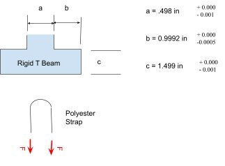

## Parametric Design
For my bracket, I used my calculations based off my deflection values as they are larger than my stress values, as my design needed the larger values to meet the strength and stiffness requirements of the bracket.

I started off my CAD by adding in all of my parametric equations. However, I noticed a flaw in my calculations. I made an error on my flange length by using the incorrect radius. Therefore, I solved in the parametric equation the correct value for the length and adjusted my values to match the new correct length as seen in the image below.

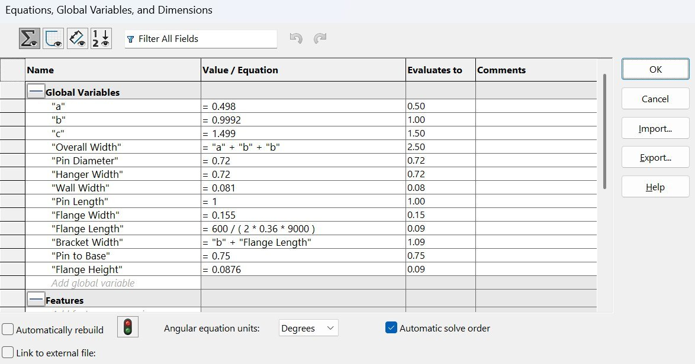

After all the dimensions were corrected, I started modeling the top of the bracket and applied my global dimensions as I went.

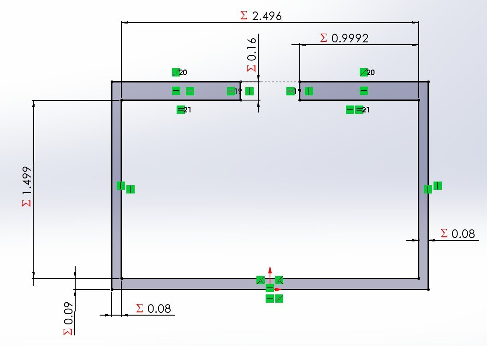
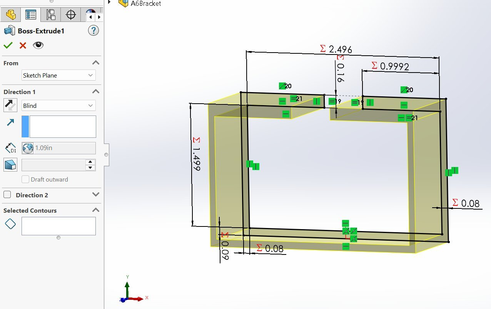

With the top of the bracket complete, I moved onto the hanger and pin. I used my global dimensions as I designed both features. I had to adjust my pin length from 0.75in to 1in in order for it to be long enough as 0.75in was too short. 

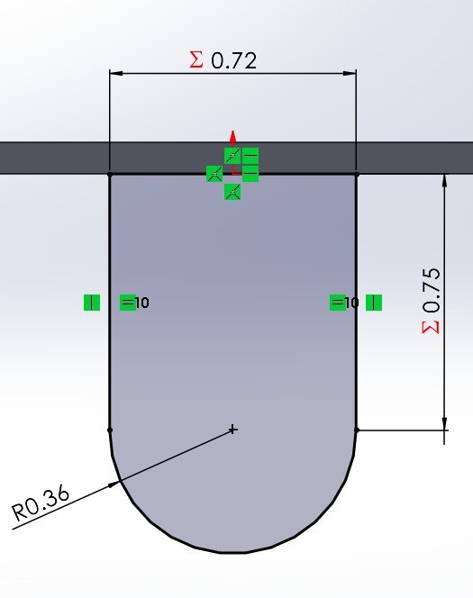
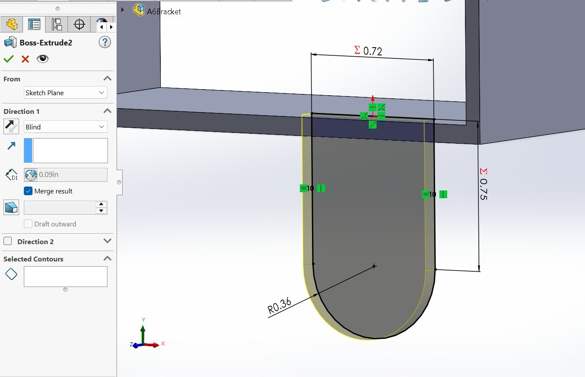
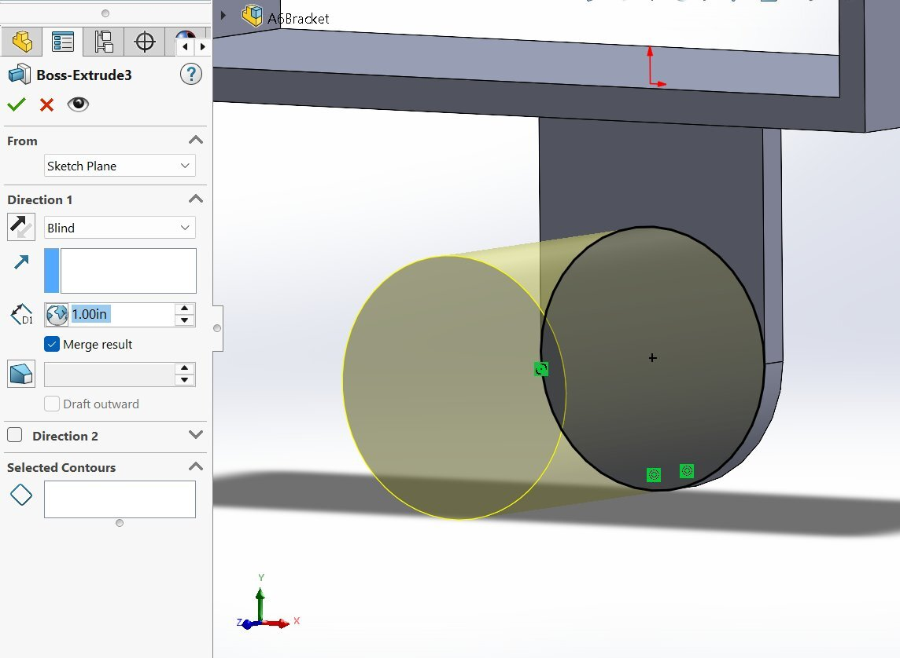

Now that the model was completed, I went through it to ensure I chose the correct dimensions for each part of the value. Once I ensured that everything was correct, I moved onto my 2D drawing.

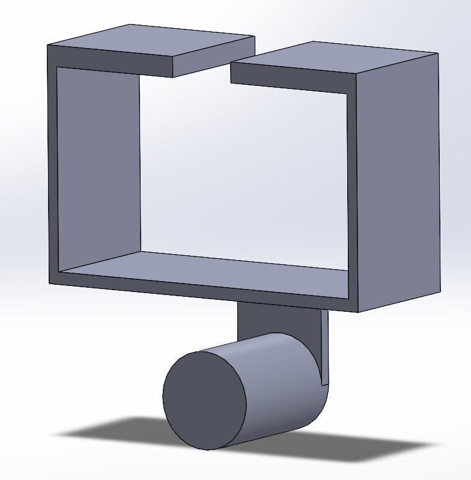

## Drawing
For the drawing, I made a new drawing file from the Solidworks part file. I ensured that the drawing was in "Third Angle Projection" and then created my isometric views. I created the front, top and right drawing as well as an isometric view at the top right of the page. Once all my drawings were in and scaled correctly, I added my dimensions accordingly. I ensured to add tolerances where the bracket would slide into the right T beam to make sure that my bracket would fit. Once all the dimensions and tolerances were added, I made sure all the information was correct.

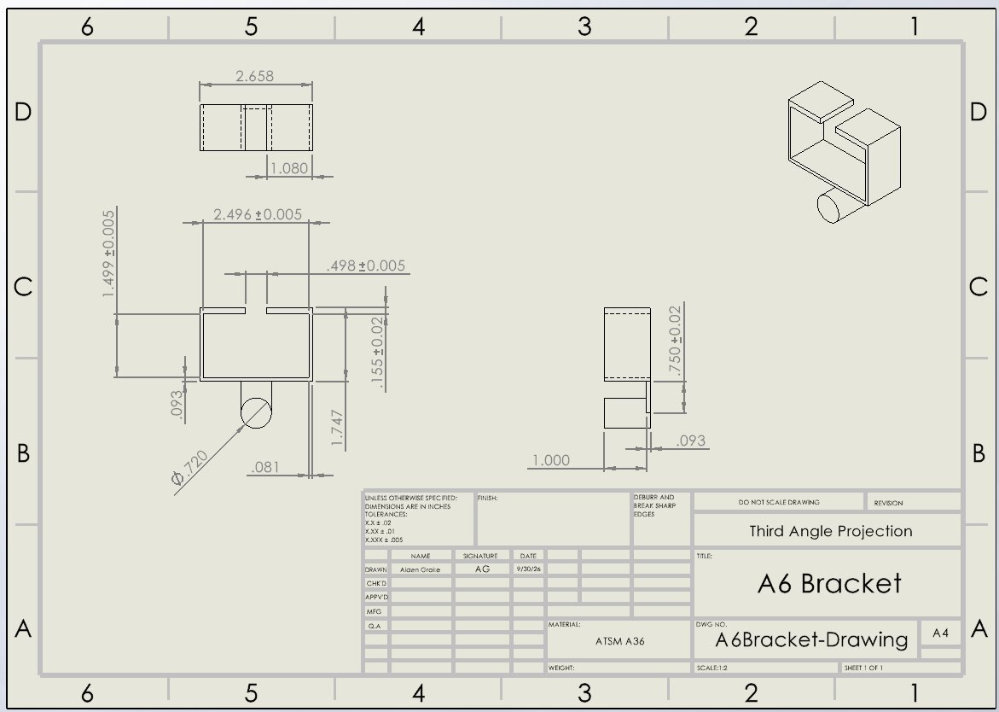

## Reflection
a. For feature A, I used a strength equation based off of bending stress in order to calculate the diameter and radius of the pin. I then used this value as a global variable in Solidworks, so if the value needed to be changed, I could do it easily. If this diameter and radius value were to change, the hanger value would need to be re-evaluated to account for the diameter change. This would need to be done by hand.

b. For tolerance, I made my a, b, c dimensions to all have a tighter tolerance class, as if the t bar wouldn't fit into the bracket. This would make the whole design essentially useless. For my looser tolerances, I chose non-essential components. For example, my flange width and pin to base dimensions have these looser tolerances as the bracket would still function correctly if the dimensions were slightly off. If every dimension had a tight tolerance, that would raise the manufacturing cost significantly, as the tighter the tolerance, the more costly it makes for the manufacturer.

In total, this assignment took me four hours in total.

## 2157
1. Parametric Design

For my design, I made the width the same as the wall width. I kept the hole cutout diameter the same as the pin diameter. As well as these, I made the link diameter 1in in order to give enough space from the cutout to the edge in order to keep the stress and deflection down. 

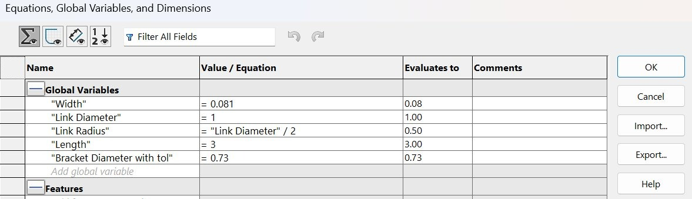
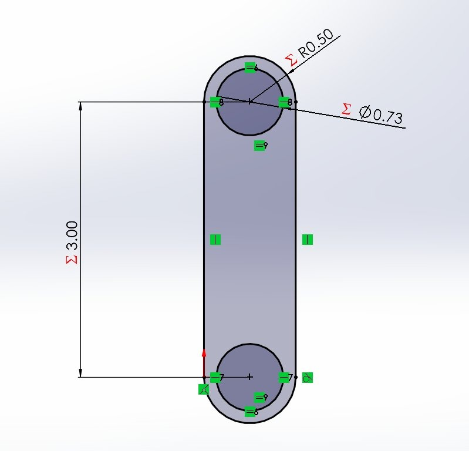
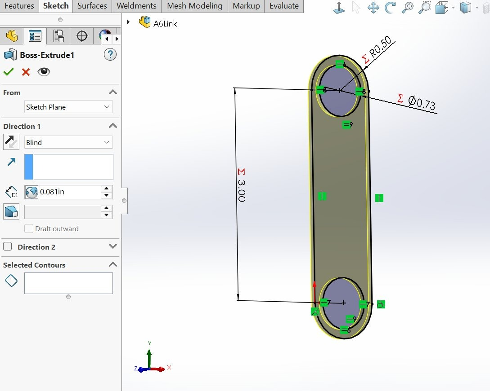

2. Drawing

With the CAD complete, I then created my drawing. I used the same standards I did with the bracket drawing. I made sure to add callouts for features that interact with the bracket.

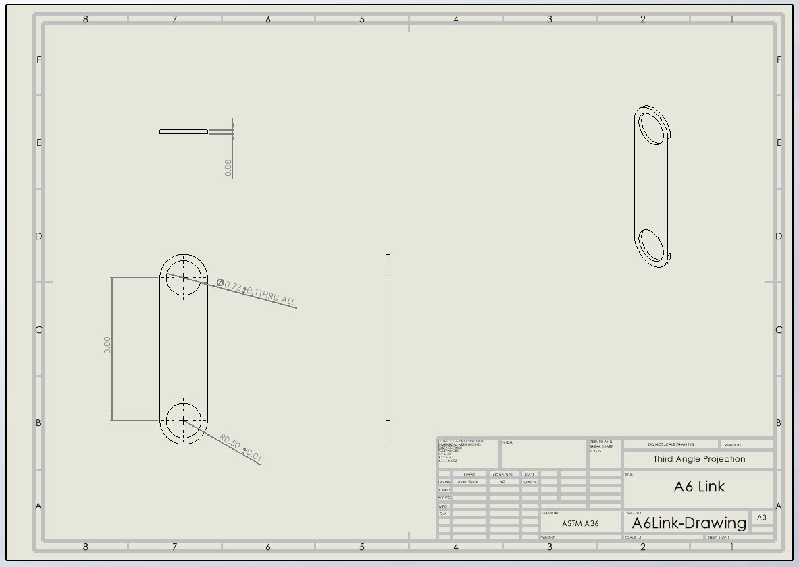

3. Reflection

For this assignment, I learned that tolerances are important when parts interact with one another to ensure proper fitment. For example, I added a clearance hole, which is why the pin diameter in the link is 0.01" to ensure it can easily slide into place.

Dimensions and tolerances are to communicate how parts are to be manufactured. Dimensions are to communicate the size of the part while tolerance is to communicate the variance of the size of the part that will be acceptable to still function correctly.

## Files
[A6Bracket.SLDPRT](A6Bracket.SLDPRT)

[A6Bracket-Drawing.SLDDRW](A6Bracket-Drawing.SLDDRW)

[A6Link.SLDPRT](A6Link.SLDPRT)

[A6Link-Drawing.SLDDRW](A6Link-Drawing.SLDDRW)

