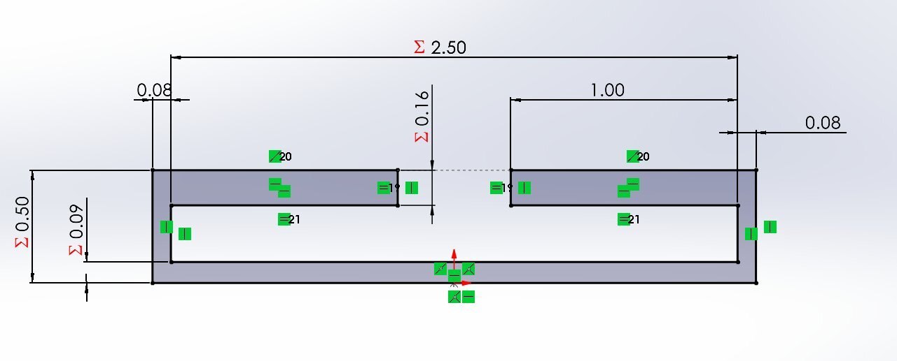
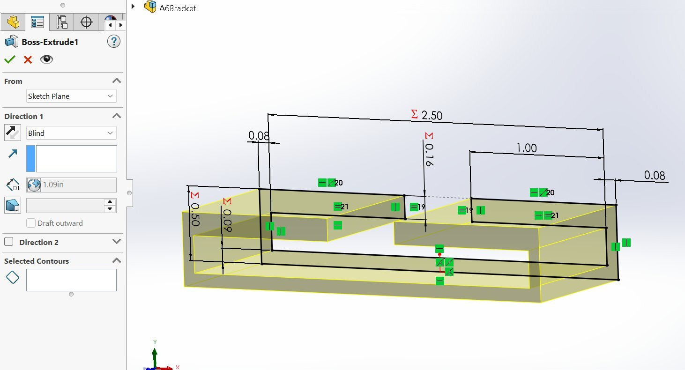
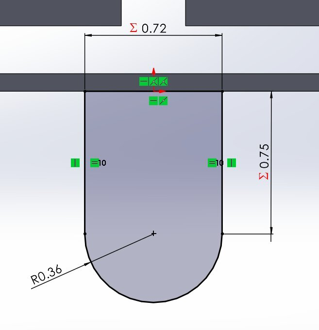
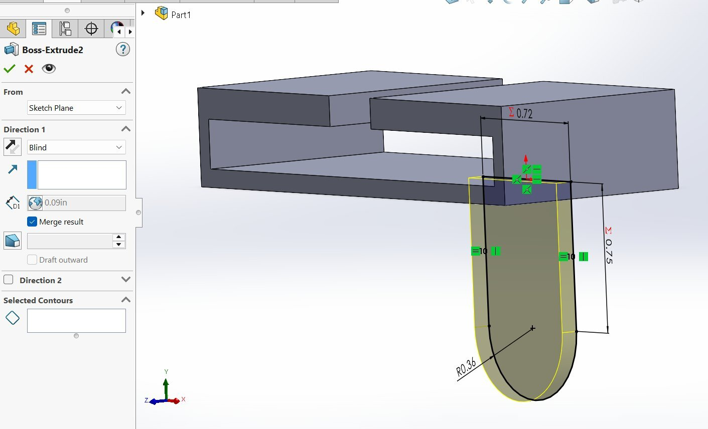
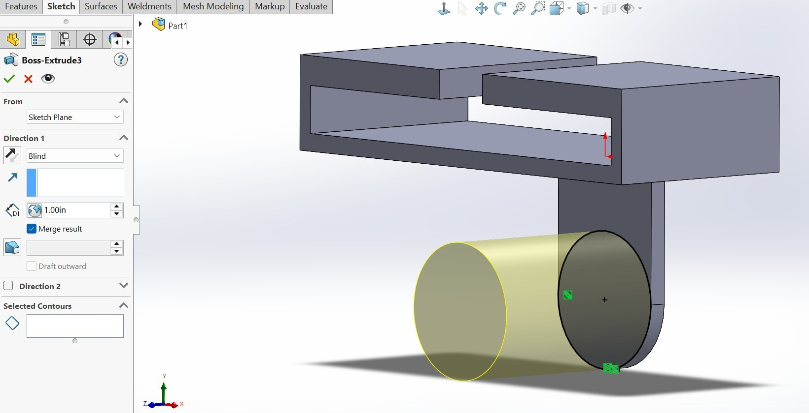
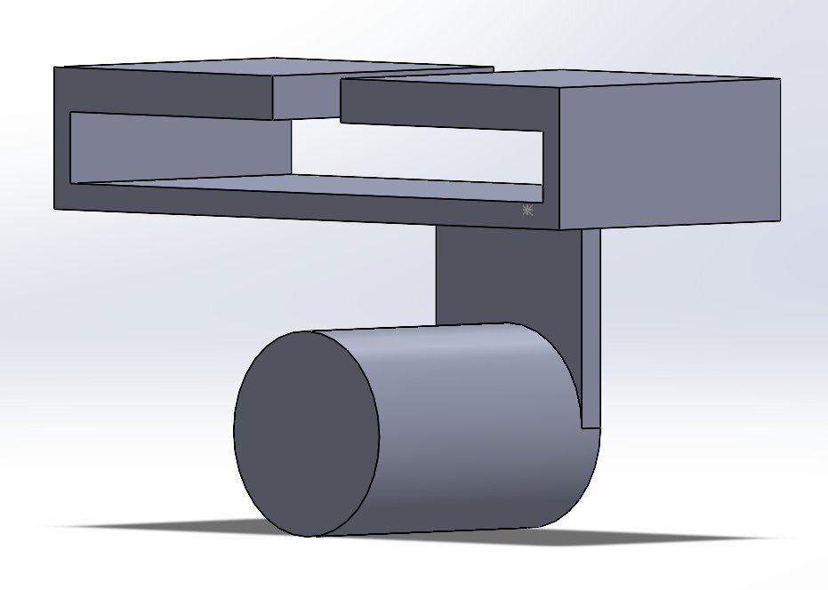
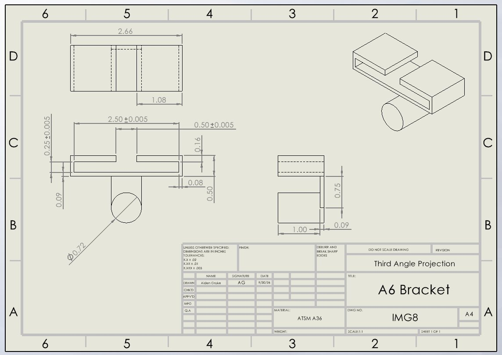

# A6 – [Bracket Drawing]

## Objective
For this assignment, I was tasked to create a 3D model and a 2D drawing of my calculated bracket that was previously designed in assignment A5.

## Parametric Design
For my bracket, I used my calculations based off my deflection values as they are larger than my stress values, as my design needed the larger values to meet the strength and stiffness requirements of the bracket.

I started off my CAD by adding in all of my parametric equations, however, I noticed a flaw in my calculations. I made an error on my flange length by using the incorrect radius, therefore I solved in the parametric equation the correct value for the length and adjusted my values to match the new correct length as seen in the image below.\

After all the dimensions were corrected, I started modeling the top of the bracket and applied my global dimensions as I went.

With the top of the bracket complete, I moved onto the hanger and pin. I used my global dimensions as I designed both features. I had to adjust my pin length from 0.75in to 1in in order for it to be long enough as 0.75in was to short. 

Now that the model was completed, I went through to ensure I chose the correct dimensions for each part of the value. Once I ensured that everything was correct, I moved onto my 2D drawing.

## Drawing
For the drawing, I made a new drawing file from the Solidworks part file. I ensured that the drawing was in "Third Angle Projection" and then created my isometric views. I created the front, top and right drawing as well as an isometric view at the top right of the page. Once all my drawing were in and scaled correctly, I added my dimensions accordingly. I ensured to add tolerances where the bracket would slide into the right T beam to make sure that my bracket would fit. Once all the dimensions and tolerances were added, I made sure all the information was correct.

## Reflection

